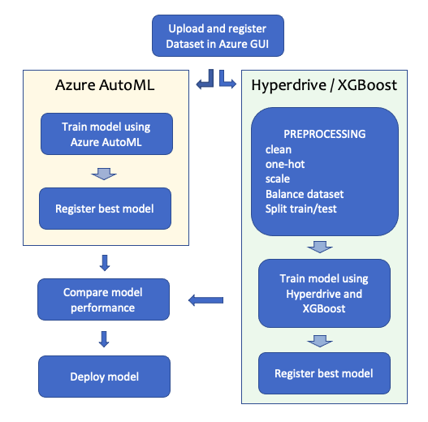
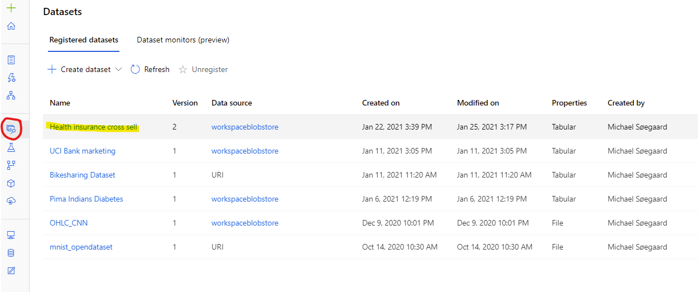
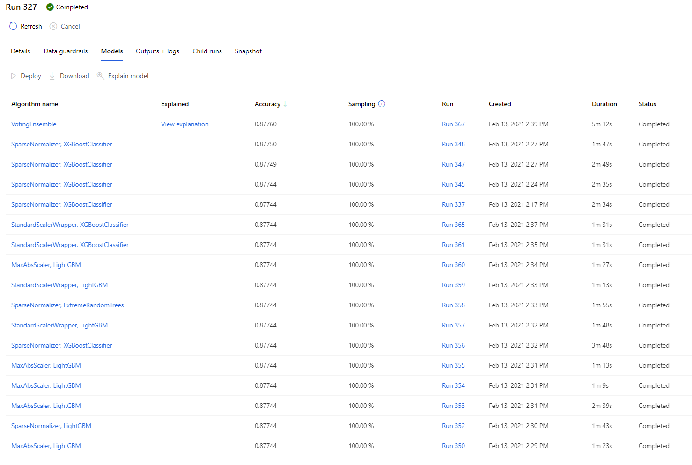
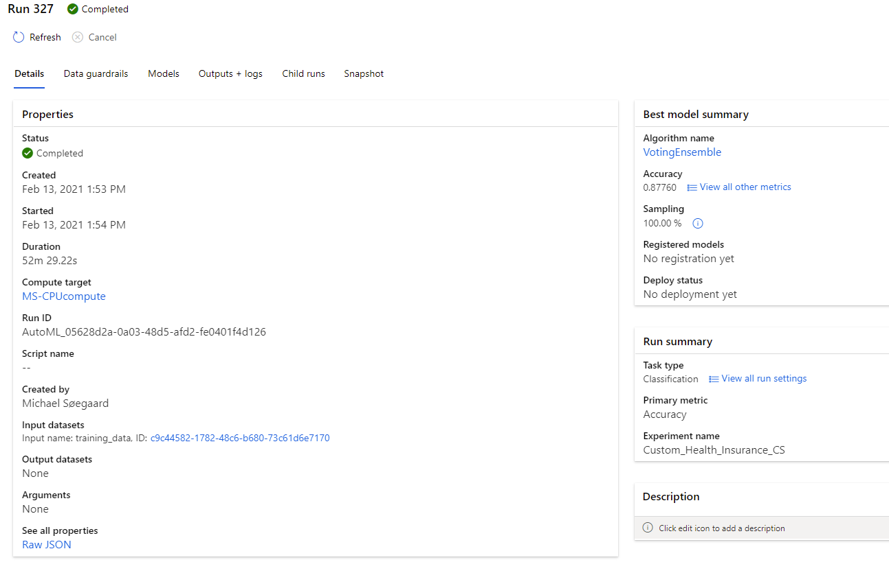
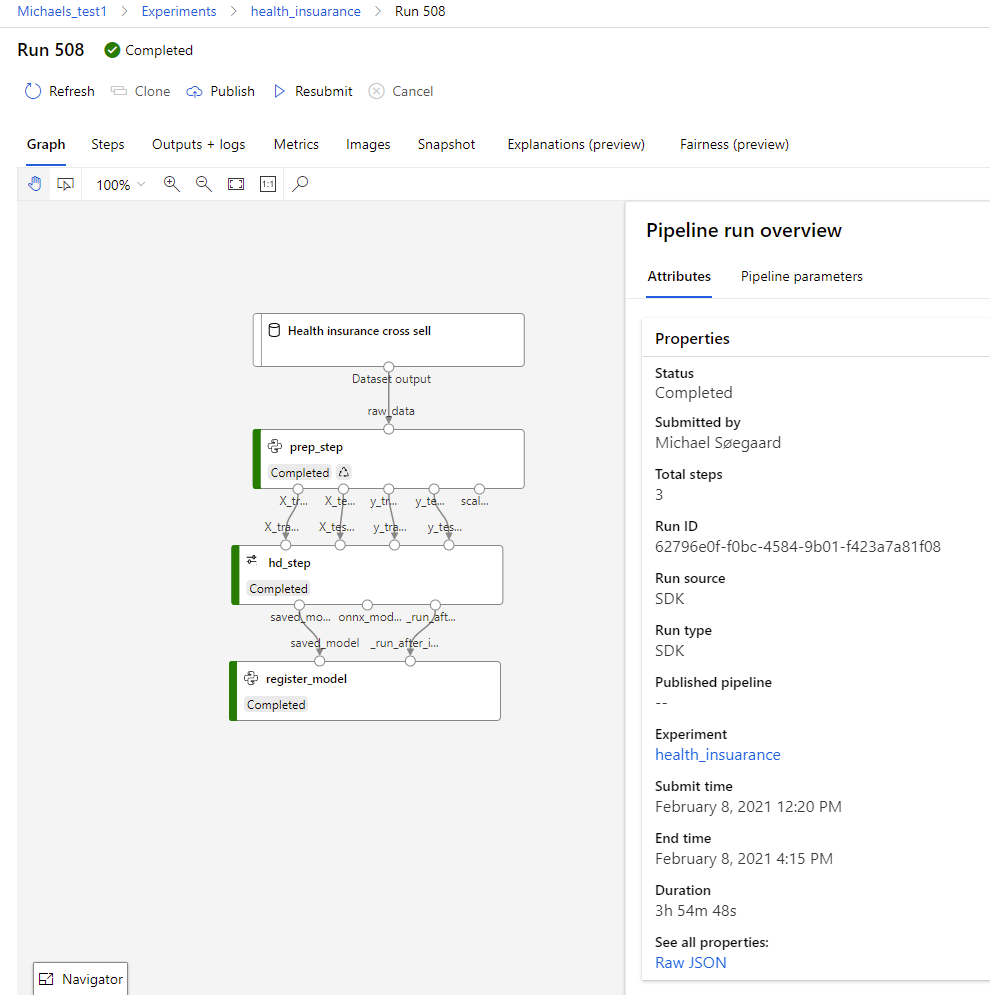
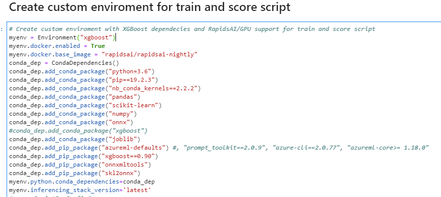
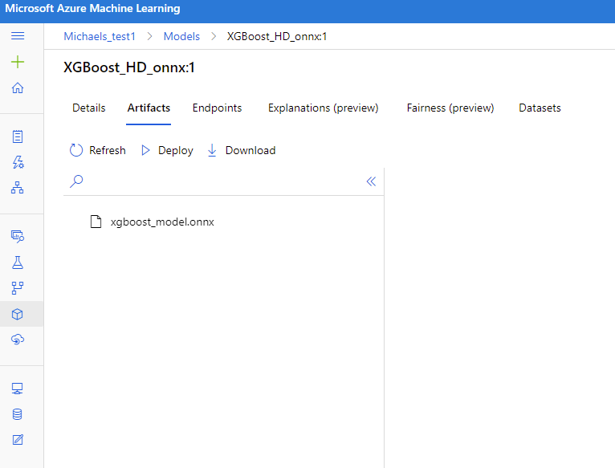
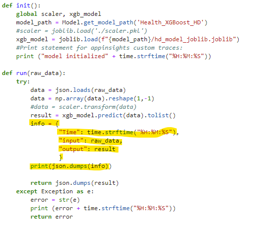
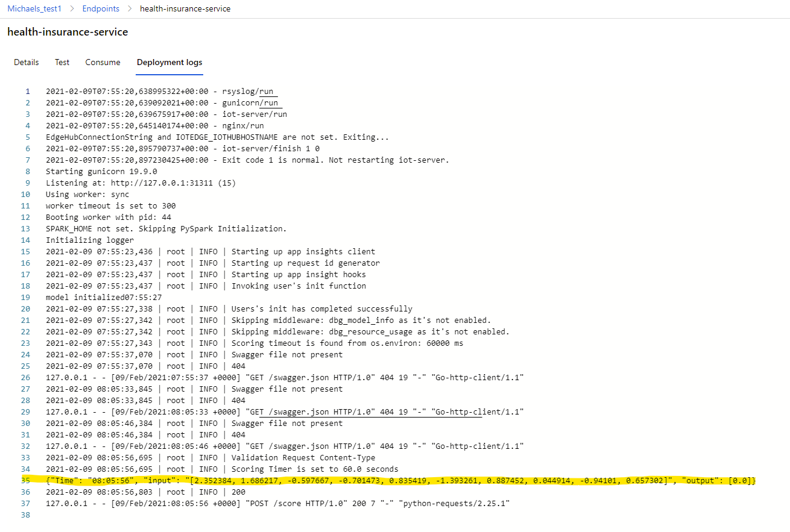
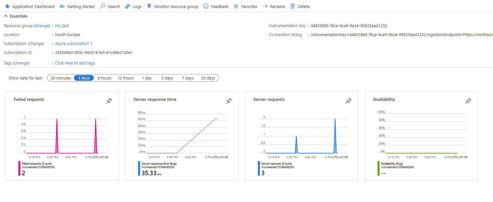

# Health insurance cross sell prediction

## Table of contents

- [Table of contents](#table-of-contents)
- [Overview](#overview)
    + [Architecture](#architecture)
    + [Dataset](#dataset)
    + [Task](#task)
    + [Access](#access)
- [Project Set Up and Installation](#project-set-up-and-installation)
- [Automated ML](#automated-ml)
    + [Run-details](#run-details)
    + [Results](#results)
    + [Best AutoML Model](#best-automl-model)
- [Hyperdrive / XGBoost model](#hyperdrive---xgboost-model)
    + [XGBoost](#xgboost)
    + [Run-details](#run-details-1)
    + [Results](#results-1)
    + [Best hyperdrive model](#best-hyperdrive-model)
- [Model Deployment](#model-deployment)
- [Screen Recording](#screen-recording)
- [Standout tasks done](#standout-tasks-done)
    + [Using Pipeline](#using-pipeline)
    + [Custom environment](#custom-environment)
    + [ONNX model](#onnx-model)
    + [Enabled logging in the scoring script](#enabled-logging-in-the-scoring-script)
- [Future Improvements](#future-improvements)

## Overview

This is a dataset containing info on current customers at an insurance agency. We want to predict which of them are interested in a vehicle insurance. So it's a binary True/False prediction.

First I did some analysis of the dataset to test for missing data, feature correlations etc. But as that is not a part of the scope for this assignment I won't include the findings other than the resulting preprocessing script "prep.py".

I will train the dataset using AutoML as well as create a pipeline using Hyperdrive and an XGBoost estimator. AutoML receives the raw dataset without any preprocessing like scaling, target balancing etc., while the pipeline includes a preprocessing step.

The best performing model is the Hyperdrive/XGBoost with an accuracy of **90.57%** while the AutoML achieved an accuracy of **87.76%** with a VotingEnsemble consisting of 7 XGBoost and 1 RandomForest classifiers.

In the end we choose the best model and publish it.

#### Architecture

For this project I wanted to create a pipeline to automate the process as much as possible, making it easier to retrain and publish a new model when necessary. But to comply to the terms of this Udacity assignment I trained the AutoML model in a separate notebook. Otherwise I would have made it part of the pipeline. 

On Azure I created a separate project folder for this project. Within the projectfolder I had to create subfolders for each step-script to avoid a "Snapshot sizelimit" of 300 MB. A common challenge AzureML has.

#### Dataset

Dataset and info can be found at kaggle: https://www.kaggle.com/anmolkumar/health-insurance-cross-sell-prediction

This is a dataset containing info on current customers at an insurance agency. 

The dataset includes 11 features and a binary label (1/0). The dataset has 381.109 samples (rows).

**Features**

- **id: ** id number of customer. But as it is starting at 1 and continuous we will use this as our dataset index.

- **Gender:** *Categorical*: Male or female

- **Age:** *Numerical*: Age of the customer

- **Driving License:** *Categorical/Binary*: Does the customer have a driving license? 1 = True, 0 = False

- **Region code:** *Categorical*: The region the customer belongs to.

- **Previously insured:** *Categorical/Binary*: Has the customer already a vehicle insurance (with another company)? 

  ​										1 = True, 0 = False

- **Vehicle Age:** *Categorical/Ordinal* : How old is the customers vehicle?  < 1 year, 1-2 years,  >2 years

- **Vehicle damage:** *Categorical/Binary*: Has the customer previously had any damages to their vehicle? Yes/No

- **Annual Premium:** *Numerical*: How much will the new vehicle insurance cost?

- **Policy sales channel:** *Categorical*: Anonymized data, but  relates to: by mail? by phone? in person? etc.

- **Vintage:** *Numerical*: How many days has the customer been with the company?

In the preprocessing for Hyperdrive/XGBoost we mark which features are categorical, ordinal or numeric. Categorical features are one-hot encoded.

The dataset is quite unbalanced as it has 381.109 rows, but only 46.710 rows (about 12%) belongs to the "1" (True) category. As the target/label isn't balanced we need to balance them. For that we're going to use SMOTETomek which is an sampler that does a combination of under- and oversampling. The sampler is from the ["imbalanced-learn" project](https://pypi.org/project/imbalanced-learn/).

We split the dataset into train, test (and labels) and scale them. Scaler is only fitted to training data to avoid leakage into the test set.

#### Task
We want to predict which of the existing healthcare customers are interested in a vehicle insurance. So it's a binary True/False prediction.

#### Access
Dataset is uploaded and registered to AzureML datasets using the Azure GUI. In the project notebooks we will reference the registered dataset. The reference is created by searching by name in datasets in the current workspace. If the dataset is not found among the existing datasets on Azure, it will get downloaded from Kaggle.

## Project Set Up and Installation

*This project requires an Azure account.*

1. Make sure you have created a workspace for the project. You can find a guide [here](https://docs.microsoft.com/en-us/azure/machine-learning/how-to-manage-workspace?tabs=python).
2. Clone the project: `$ git clone https://github.com/MichaelSoegaard/AzureML_Health_Insurace_Cross_Sell.git`
3. Using the Azure GUI, upload the dataset from "data" folder to "datasets". Name the dataset "Health insurance cross sell"

- *Alternatively you can download the dataset from Kaggle and unzip the contents: https://www.kaggle.com/anmolkumar/health-insurance-cross-sell-prediction and upload it to Azure using the "Datasets" GUI.*

4. Once dataset has been registered you're ready to modify and run notebooks you cloned from this repository

## Automated ML
I used AutoML as some sort of highend baseline for the data, as a reference for my primary model created using Hyperdrive. The settings I used for the AutoML was:

- **Task:** Classification
- **Primary metric:** Accuracy. When the dataset is balanced as we have made it we can use the metric "accuracy" without any problems. Also this is isn't a critical disease we need to predict so "false negatives" isn't a big issue. 
- **N cross validation:** 5 - Usual values are 3, 5 and 10. But 5 gives a reliable result. 10 takes longer to compute.
- **Enable early stopping:** True - saves us some computational power by stopping runs that shows early signs of giving a bad result (compared to previous runs)
- **Featurization:** Auto - to let AutoML handle preprocessing of dataset as this is somewhat of a simple dataset and doesn't require much feature engineering.

#### Run-details

#### Results

To my surprise most of the different runs/models had the exact same accuracy of 87.74% which seemed a bit odd. It could be related to the nature of an "easy" dataset as well as the stable result from cross-validation.

#### Best AutoML Model

## Hyperdrive / XGBoost model
#### XGBoost

For this task I choose XGBoost because I have had great results with this model previously. I wanted something more complex than a linear model and I wanted to implement a model I could train on GPU, which is a lot faster than using a CPU compute-target.

Because I wanted to use GPU I had to create a custom environment for training of the model. I created an environment based on a RapidsAI base-image and then adding the necessary dependencies to the image.

For sampling of the hyperparameter space I choose Baysian sampling as it is more "clever" than eg. random. It learns from previous runs what parameters seems to work and then narrows it down. For that reason I also choose only to have 2 concurrent runs running.

Based on experience, the hyperparameters I choose to search over was:

- **Learning rate:** 0.1 and 0.05
- **n_estimators: ** Between 1200 and 2500 with step size of 200
- **Max_depth:** Between 12 and 24 with step size of 2
- **Subsample:** 0.8 and 0.9
- **Colsample_bytree:** 0.8 and 0.9

#### Run-details

#### Results

The best performing model has an accuracy of 90.57%.

The hyperparameters are:

- **Learning rate:** 0.05
- **n_estimators: ** 1200
- **Max_depth:** 20
- **Subsample:** 0.9
- **Colsample_bytree:** 0.9

#### Best hyperdrive model

## Model Deployment

I choose to use a model from my pipeline/Hyperdrive run as it performed better than the AutoML model. To deploy the model I created an inference_config, which points to my score script as well as my custom environment with XGBoost.

Then I created the AciWebservice, which defines the hardware requirements as well as enables application insights. I had to increase `memory_gb` to 2 as it failed with only 1. 

Finally I could deploy my model, which took about 10 minutes. When ready I checked the status was "healthy" and printed Scoring and Swagger URI's.

I was time to test the published endpoint. I retrieved a key for authorization, selected my test data and sent a Json request to the endpoint with my test data to verify the service was running, could consume the input and send a prediction back.

 

## Screen Recording

https://youtu.be/xPH9KxqU5Pc
- A working model
- Demo of the deployed  model
- Demo of a sample request sent to the endpoint and its response

## Standout tasks done
To challenge myself I also made the following extra steps:

* Hyperdrive was run in a pipeline including a step registering the model
* I created custom environments for training and scoring based on a RapidsAI image to accelerate training using a GPU as compute target.
* I exported and registered a ONNX model
* I enabled logging the the deployed Web app.

#### Using Pipeline

#### Custom environment

#### ONNX model

#### Enabled logging in the scoring script

`deployment_config = AciWebservice.deploy_configuration(cpu_cores = 1, memory_gb = 2, auth_enabled = True, enable_app_insights=True)`

## Future Improvements

- Add an analysis step to the pipeline uploading graps etc. to the Experiment
- Publish the pipeline, making it possible to train it again when new data is collected.
- Try to increase accuracy with other estimators than XGBoost, eg. Random Forest.
- Making an ensemble of estimators. It might increase the accuracy a bit but I wouldn't expect major improvements.
- Add a section that profiles the model to determine resources needed for inference deployment.
